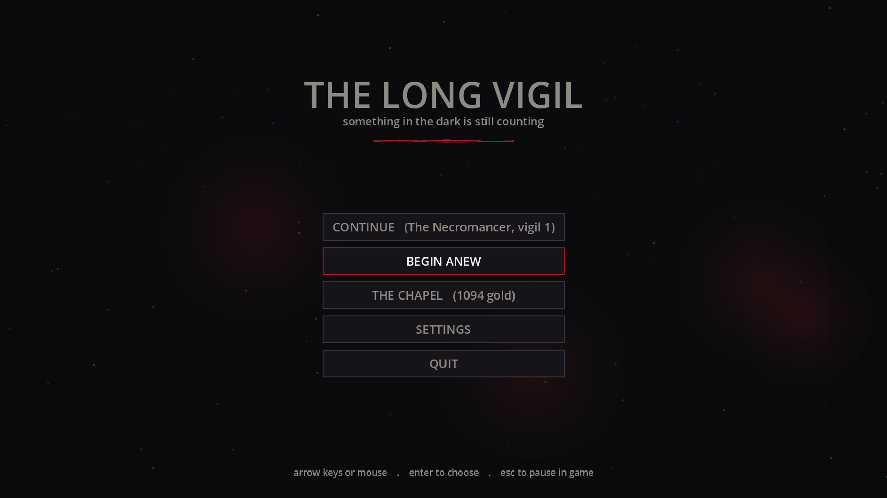
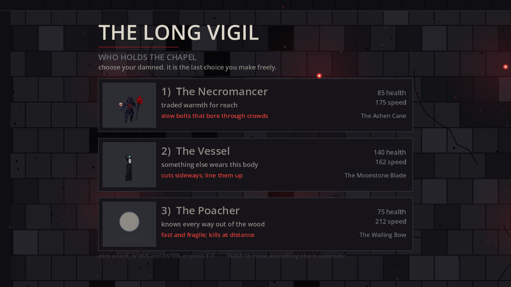
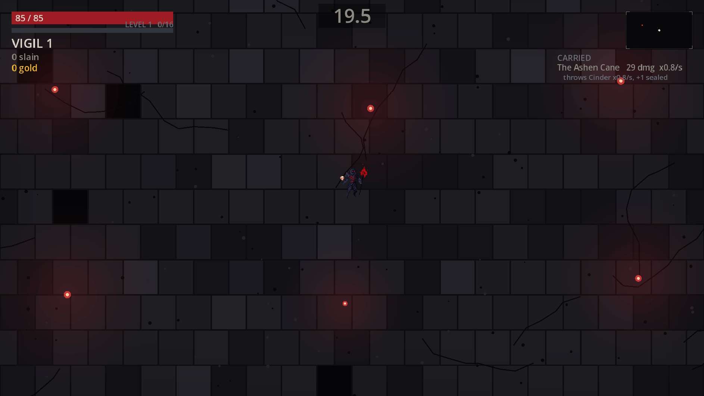

# Vigil

Vigil is a small dark-fantasy arena roguelite demo game project. I am building
it to learn Godot 4, GDScript, game architecture, balancing, and pixel-art
presentation. It is a learning project, not a finished commercial game.

The goal is simple: survive a ruined chapel, choose upgrades that always come
with a cost, and try a different build on the next run.

## Screenshots

Captured from the running project at 1920x1080:







## Run it

1. Install Godot 4.6 or newer.
2. Import this folder through the Godot project manager, selecting
   `project.godot`.
3. Press **F5**.

The default scene is the main menu. To start directly in the arena, open
`main.tscn` and press **F6**, or run:

```bash
godot --path . res://main.tscn
```

The project targets a 1920x1080 window. Gameplay is rendered as a 960x540
world scaled by 2x, while the HUD stays at native resolution.

## Controls

| Key | Action |
|---|---|
| WASD / arrow keys | Move and navigate menus |
| Mouse | Choose cards and menu options |
| 1-4 | Choose a card directly |
| Esc | Pause or return from a screen |
| R or click | Rise again after death |

## What is implemented

- Three playable characters with unique weapons and attack bolts.
- Fifteen escalating vigils in a procedural chapel arena.
- Automatic attacks, enemy waves, bosses, chests, coins, soul motes, and XP.
- Three-tier pact choices where every upgrade also has a downside.
- Permanent per-character upgrades in the Chapel.
- Save and continue support for runs and profile progression.
- Main menu, pause screen, settings, character select, pact screen, death
  screen, and run tally.
- Runtime smoke tests and headless balance simulations.

### Characters

| Character | Weapon | Style |
|---|---|---|
| The Necromancer | The Ashen Cane | Slow ranged bolts and piercing attacks |
| The Vessel | The Moonstone Blade | Melee cuts and thrown blades |
| The Poacher | The Wailing Bow | Fast ranged attacks |

## Project map

| File | Purpose |
|---|---|
| `main.gd` | Arena loop, spawning, combat flow, HUD, and states |
| `player.gd` | Player movement, stats, weapons, and animation |
| `characters.gd` | Character and weapon data |
| `enemy.gd` / `enemy_kinds.gd` | Enemy behavior and archetype data |
| `pacts.gd` | Pact data and modifiers |
| `chapel.gd` / `upgrades.gd` | Between-run upgrades |
| `menu.gd` / `menu.tscn` | Main and pause menus |
| `dungeon.gd` | Procedural arena floor |
| `palette.gd` / `ui_theme.gd` | Shared visual styling |
| `tools/smoke_test.gd` | End-to-end state and character check |
| `tools/balance_sim.gd` | Headless balance simulation |

Most gameplay is currently drawn and controlled in code rather than assembled
from scenes. Converting more systems into reusable Godot scenes is part of the
learning plan.

## Checks

Run the end-to-end smoke test after gameplay changes:

```bash
godot --headless --path . -s tools/smoke_test.gd
```

Run the balance simulation after changing numbers:

```bash
godot --headless --path . -s tools/balance_sim.gd
```

## More documentation

- [Project status](docs/STATUS.md)
- [Development plan](docs/PLAN.md)
- [Balance notes](docs/BALANCE.md)
- [Meta progression](docs/META.md)
- [Asset notes](docs/ASSETS.md)
